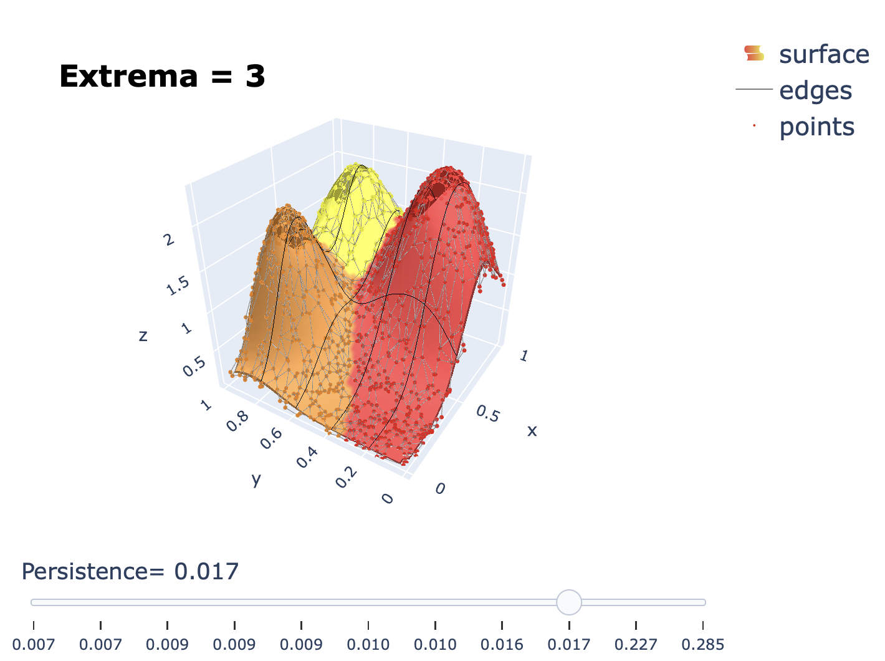

# spatial-anomaly-top
Topological tools for identifying spatial anomalies in environmental exposure and cancer data. The script "morse_visualizer.py" takes a real-valued function defined on $\mathbb{R}^{2}$ and provides an interactive visualization of its Morse complex segmentation equipped with a slider to vary $\textit{persistence}$.

## Requirements 

The script morse_visualizer.py requires the Python packages [hdtopology](/guides/content/editing-an-existing-page), scipy, plotly, and numpy.

## Usage 

Here is an example using the terrain.txt data provided in the data folder:

```bash
python3 morse_visualize_args_v2.py --input="terrain.txt" --output="terrain_morse.html"
```
By default edges are calculated using the [Gabriel graph](https://en.wikipedia.org/wiki/Gabriel_graph). To specify edges, include the options "--edges=1 --edges_file="edges.txt"", where "edges.txt" is formatted so that each line includes the vertex indices for a single edge.

## Output
<p align="center">

